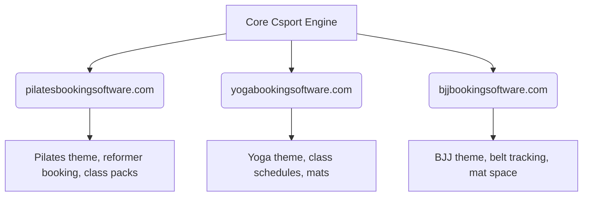

# Csport: Multi-Niche EMD SEO & Product Strategy

This document outlines the strategic roadmap, target keywords, exact-match domain portfolio, and product architecture for **Csport** (the booking and studio management platform).

---

## 🎯 1. The Csport Core Concept

Instead of marketing a single generic brand (like Mindbody or Bsport), **Csport** uses a multi-brand, niche-down strategy:

1.  **Unified Core Platform**: One robust, backend booking and management engine.
2.  **Modality-Specific Skins**: Deploying the same application under different domains, styled with custom themes, terminology, and imagery for each specific sport (e.g., Pilates, Yoga, BJJ).
3.  **Low-Friction Hook**: "Full-feature, Free for Life" if self-hosted; a competitive monthly fee for managed hosting.
4.  **Monetization Engine (The Hive)**: Charging premium fees for specialized **agentic workflows** (AI agents executing tasks like review generation, lead nurturing, ads automation).

---

## 📈 2. Semrush Keyword Data (B2B Niche Software)

Our Semrush keyword data shows highly valuable B2B search terms with low keyword difficulty (KD), making them prime targets for an **Exact Match Domain (EMD)** ranking strategy:

| Keyword | Monthly Search Volume | Keyword Difficulty (KD) | Strategic Category |
| :--- | :--- | :--- | :--- |
| **`yoga studio software`** | **480** | **17 (Easy)** | Broad Yoga launch target |
| **`pilates studio software`** | **320** | **12 (Very Easy)** | Broad Pilates launch target |
| **`software for pilates studios`** | **320** | **9 (Very Easy)** | High intent search |
| **`scheduling software yoga`** | **260** | **13 (Easy)** | Scheduling specific |
| **`yoga studio management software`** | **170** | **17 (Easy)** | High buyer intent |
| **`pilates studio booking software`** | **170** | **12 (Very Easy)** | High buyer intent |
| **`pilates booking software`** | **140** | **6 (Very Easy)** | **Lowest difficulty; easiest rank** |
| **`yoga studio booking software`** | **140** | **13 (Easy)** | High buyer intent |

---

## 🌐 3. Exact Match Domain (EMD) Roadmap

We conducted live WHOIS checks on Verisign registry port 43 to find available exact-match `.com` domains. The following portfolio allows Csport to rank organically and build instant trust:

### 🧘 Pilates Launch Target: `pilatesbookingsoftware.com`
*   **Target Search query**: "pilates booking software" (Vol: 140, KD: 6) / "pilates studio booking software" (Vol: 170, KD: 12)
*   **SEO Benefit**: KD of **6** is virtually uncontested. Deploying here allows page-1 rankings on Google almost immediately.

### 🕉️ Yoga Launch Target: `yogabookingsoftware.com`
*   **Target Search query**: "yoga booking software" / "yoga studio booking software" (Vol: 140, KD: 13)
*   **SEO Benefit**: Perfectly matches the Pilates naming convention and holds an easy KD of **13**.

### 🥋 BJJ Launch Target: `bjjbookingsoftware.com` or `bjjacademysoftware.com`
*   **Status**: Both domains are **AVAILABLE** and ready for deployment to target martial arts academies.

### 💎 General Boutique Target: `boutiquestudioplatform.com`
*   **Status**: **AVAILABLE** for broad boutique marketing (Barre, HIIT, etc.).

---

## 🛠️ 4. Product & Monetization Architecture

### Hosting Split
*   **Self-Hosted ($0)**: Completely free, full features. The studio hosts the system on their own server infrastructure or Cloudflare account.
*   **Managed Hosting (Paid)**: Low monthly subscription. We manage setup, databases, security, and updates.

### Agentic Services (The Central Hive)
We charge for premium AI-agent automation. Studios activate specific agent modules to handle business tasks:
*   **Review Generation Agent**: Automatically follows up with class visitors (differentiating locals vs travelers) to collect Google Maps or TripAdvisor reviews.
*   **Lead Nurture Agent**: Converts social media inquiries and web forms into studio bookings.
*   **Smart Scheduling Agent**: Dynamically optimizes class slots based on historical booking rates and member patterns.
